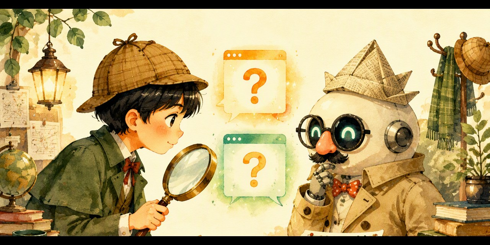

# Human or AI? · 真人还是 AI？

**🎮 点开就玩 → https://pulj26pulj26.github.io/human-or-ai/**

一个给孩子玩的图灵测试小游戏：当裁判，揪出假扮人的 AI；当教练，教机器人骗过裁判。
无需下载、无需联网、手机电脑都能玩。

A Turing-test game for kids: play the judge and spot the AI, or coach a robot to pass as human.
Single HTML file, works offline, mobile-friendly.

## 玩法

- 🕵️ **裁判模式**：A、B 两个窗口，一个是真人一个是 AI，问 3 个问题后投票，共三关，AI 一关比一关会装
- 🎓 **教练模式**：替机器人小豆挑回答，别让裁判的怀疑值爆表
- 🏆 通关获得专属「图灵裁判证书」

## 背景

【和孩子一起学AI】社群「AI十哲」系列第一课（1950 图灵《计算机器与智能》）的配套游戏。
